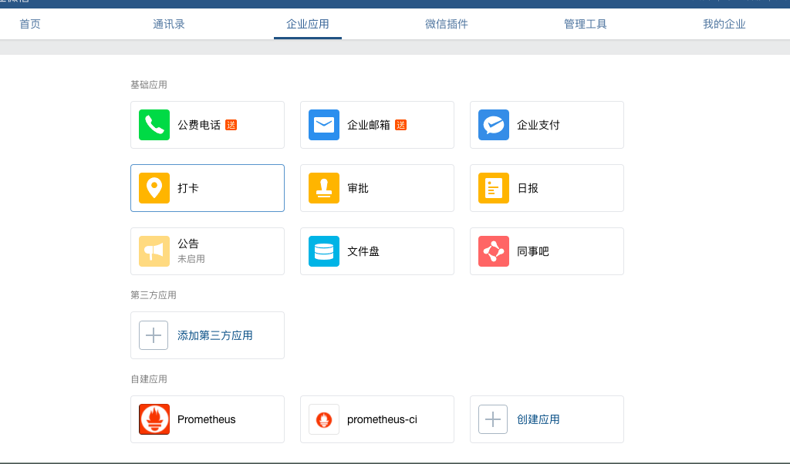
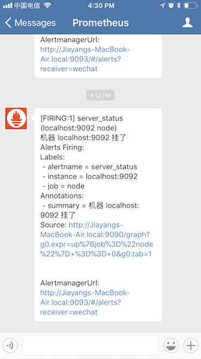

#通过企业微信接收告警

Alertmanger 从 v0.12 开始已经默认支持企业微信了，下面我们就一起体验一下。

### 准备工作

step 1: 访问[网站](https://work.weixin.qq.com/) 注册企业微信账号（不需要企业认证）。

step 2: 访问[apps](https://work.weixin.qq.com/wework_admin/frame#apps) 创建第三方应用，点击`创建应用按钮` -> 填写应用信息：



### 使用版本

- prometheus: 2.0.darwin-amd64
- node_exporter: 0.15.0.darwin-amd64
- alertmanager: 0.14.darwin-amd64

### 详细配置：

#### prometheus 配置：

```
# Alertmanager configuration
alerting:
  alertmanagers:
  - static_configs:
    - targets:
      - localhost:9093

rule_files:
  - "rules.yml"

scrape_configs:
  - job_name: 'node'
    static_configs:
      - targets: ['localhost:9100']
```

rules.yml 配置：

```
groups:
- name: node
  rules:
  - alert: server_status
    expr: up{job="node"} == 0
    for: 15s
    annotations:
      summary: "机器 {{ $labels.instance }} 挂了"
```

#### alertmanger 配置：

```
route:
  group_by: ['alertname']
  receiver: 'wechat'

receivers:
- name: 'wechat'
  wechat_configs:
  - corp_id: 'xxx'
    to_party: '1'
    agent_id: '1000002'
    api_secret: 'xxxx'
```

参数说明：

- corp_id: 企业微信账号唯一 ID， 可以在`我的企业`中查看。
- to_party: 需要发送的组。
- agent_id: 第三方企业应用的 ID，可以在自己创建的第三方企业应用详情页面查看。
- api_secret: 第三方企业应用的密钥，可以在自己创建的第三方企业应用详情页面查看。

详情请参考[文档](https://work.weixin.qq.com/api/doc#10167/%E6%96%87%E6%9C%AC%E6%B6%88%E6%81%AF)。

### 验证测试

当我们停掉 node_exporter 的时候，会收到如下告警信息：



当我们重新启动 node_exporter 的时候，会收到如下告警信息：


### 结论

企业微信从注册到 alertmanger 配置没有什么坑，而且它的通知非常及时，基本不丢消息，大家可以测试体验以下。
