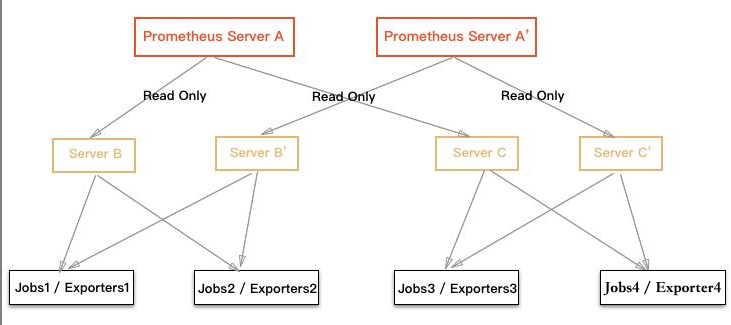
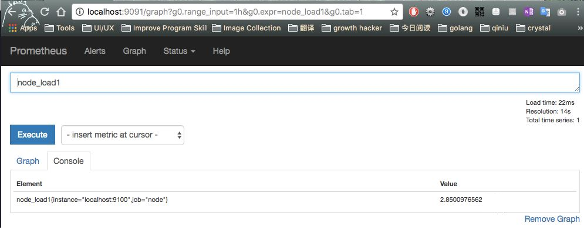
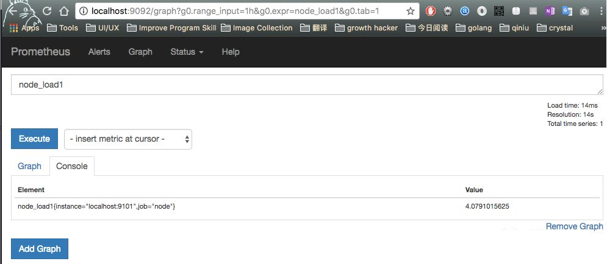
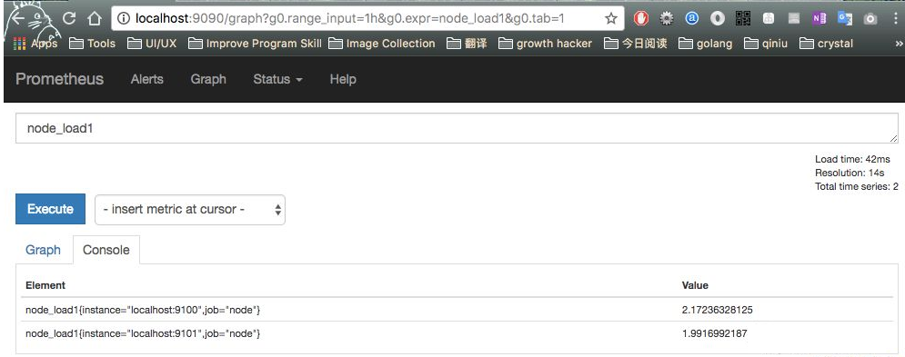
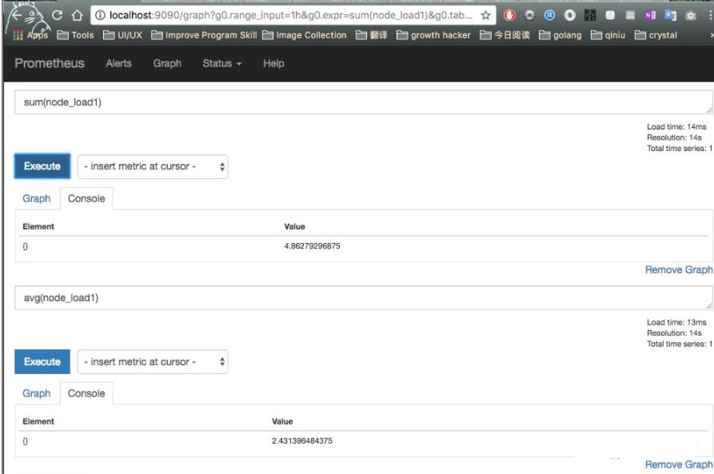

# Prometheus Server 的高可靠方案

思路：使用 remote_read 来实现 Prometheus 数据的读写分离的集群方案， 从而达到其高可用的目的，下面我将具体讲解。

### remote_read 简介

从 Prometheus 1.8 开始，增加了一个叫做 remote_read 的配置，详细信息如下：

```
# The URL of the endpoint to query from.
url: <string>

# Timeout for requests to the remote read endpoint.
[ remote_timeout: <duration> | default = 30s ]

# Sets the `Authorization` header on every remote read request with the
# configured username and password.
basic_auth:
  [ username: <string> ]
  [ password: <string> ]

# Sets the `Authorization` header on every remote read request with
# the configured bearer token. It is mutually exclusive with `bearer_token_file`.
[ bearer_token: <string> ]

# Sets the `Authorization` header on every remote read request with the bearer token
# read from the configured file. It is mutually exclusive with `bearer_token`.
[ bearer_token_file: /path/to/bearer/token/file ]

# Configures the remote read request's TLS settings.
tls_config:
  [ <tls_config> ]

# Optional proxy URL.
[ proxy_url: <string> ]
```

`remote_read` 参数用于远程读取数据，采用 http 协议。

当然作为数据源被读取需要支持它的 remote storage reader 的接口，这么设计的目的是为了在新一代的存储架构里实现解耦，很方便做到：

- Prometheus 的读写可以在不同的 Prometheus Server 进行，即一个 Prometheus 读取其它 Prometheus 的数据。
- Prometheus 的读写可以在更多的存储引擎中进行，即你完可以使用 InfluxDB 作为数据库来存储数据。

### 部署架构



架构说明：

- Server `A'` 表示 Server A 的镜像，具有相同的功能和数据（B，C 同理）。
- 数据流统一采用拉取的方式。

不难发现，架构中的 Prometheus 主要分为两类， 用于数据收集（例如 B） 和 用于数据查询（例如 A）。

数据查询的 Prometheus 会从收集到数据的节点中读取数据，请注意，它只做实时的查询以及内存运算，不做数据存储。

通过这样的架构，我们就很容易将整个监控的数据收集查询分离开了，也更容易实现高可用。

### 如何配置

下面我将通过本地实验向大家演示使用 `remote_read` 实现 Prometheus 之间数据的读取过程。

软件版本：

- Prometheus 版本： prometheus-1.8.2.darwin-amd64
- NodeExporter 版本：node_exporter-0.12.0.darwin-amd64

实验内容：

本地运行三个 Prometheus Server, 它们分别运行在 `9090`, `9091`, `9092` 端口。 其中 `9091` 和 `9092` 主要用来收集 node_exporter 数据， `9090` 用来读取 `9091`, `9092` 收集的数据。

配置信息如下：

```
# 数据读取的 9090 的配置
remote_read:
  - url: 'http://localhost:9091/api/v1/read'
    remote_timeout: 8s
  - url: 'http://localhost:9092/api/v1/read'
    remote_timeout: 8s
```

```
# 数据收集 9091 的配置
- job_name: 'node'
  static_configs:
  - targets: ["localhost:9100"]
```

```
# 数据收集 9092 的配置
- job_name: 'node'
  static_configs:
  - targets: ["localhost:9100"]
```

完成配置，并成功启动此三个实例后，我们可以在它们自带的界面中进行验证。







支持聚合运算查询：



好了，到目前为止我们已经成功实现通过 `remote_read` 配置实现从不同的 Prometheus Server 读取数据，这意味着我们先前讨论的部署架构是完全是可行的。
